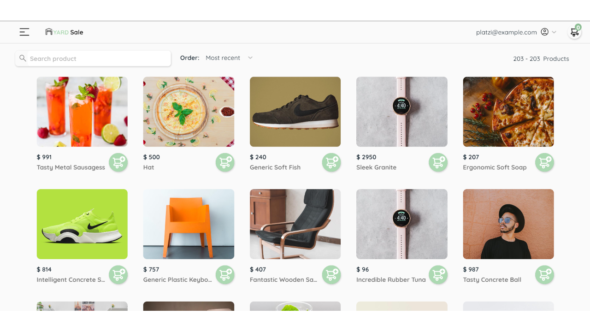
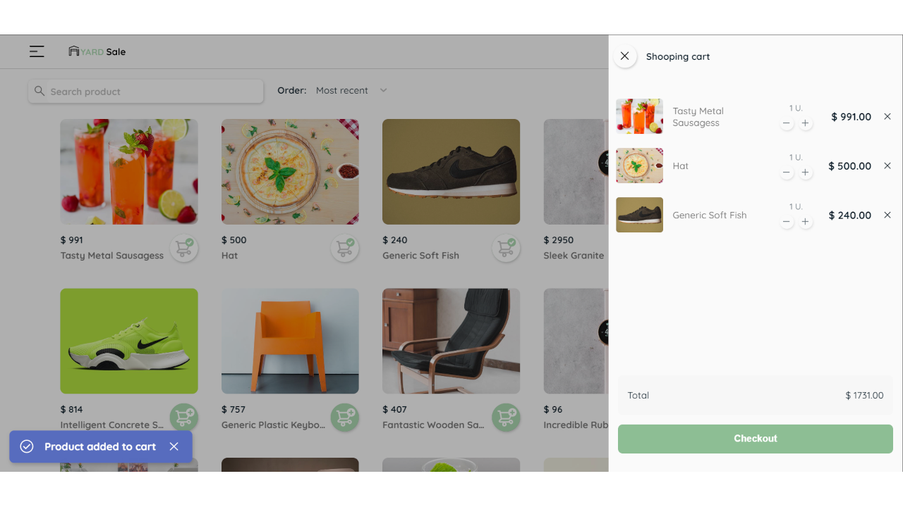
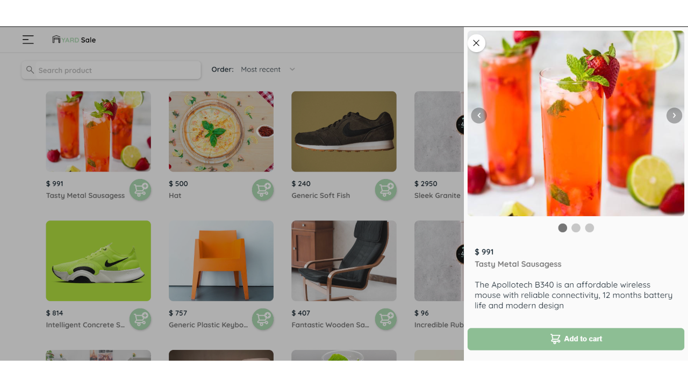
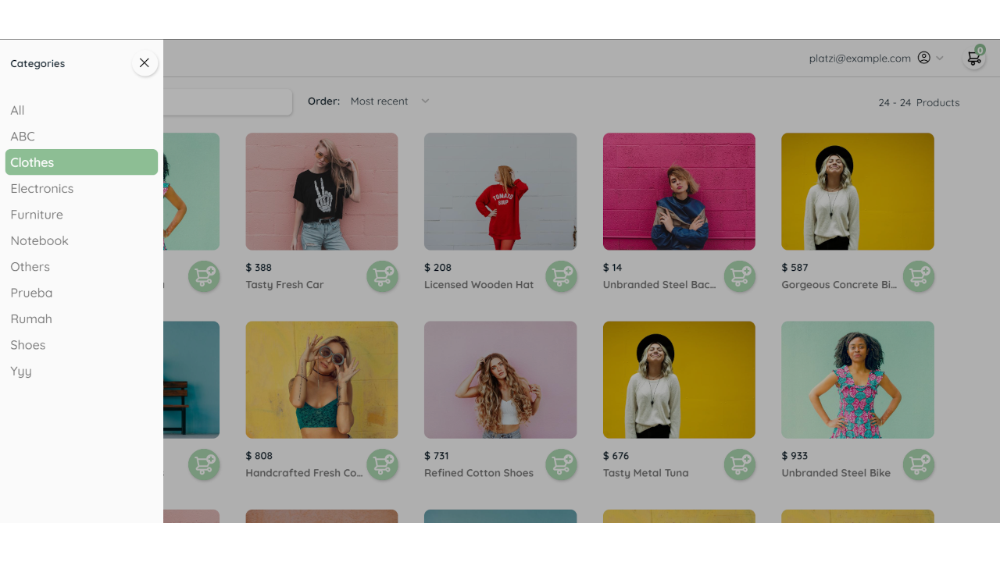
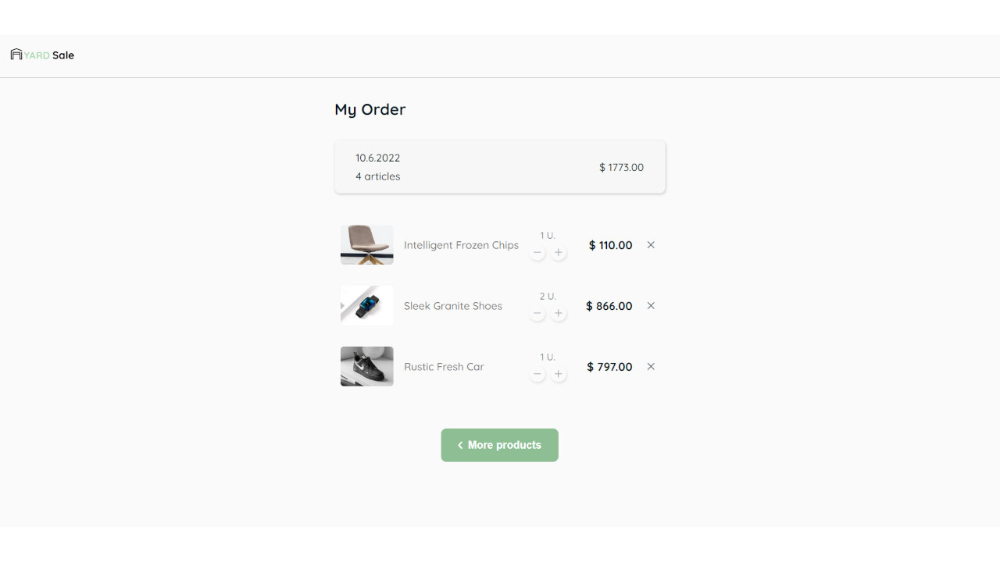
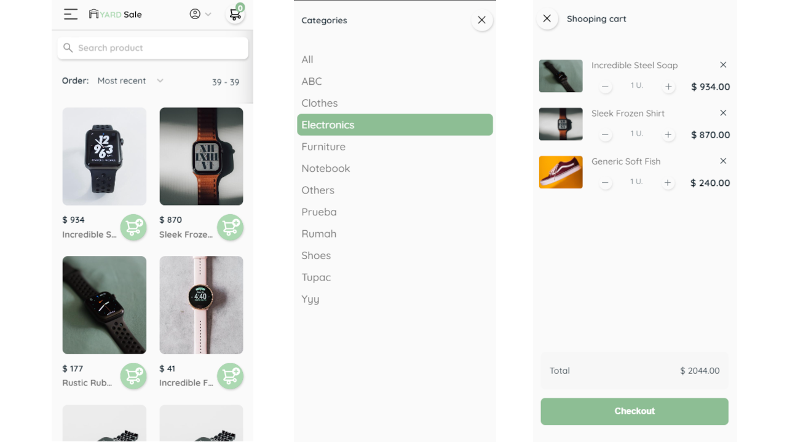
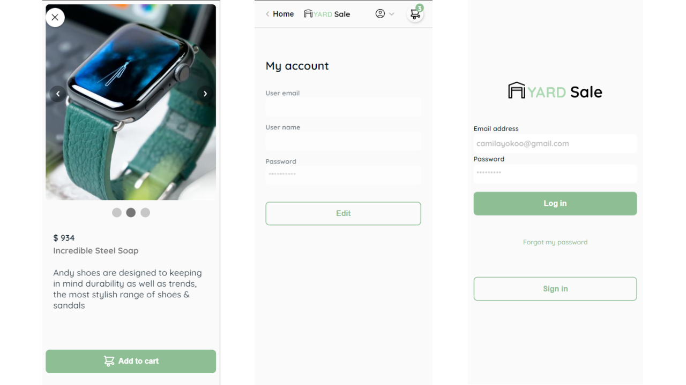

# React shop

A solution to the [Platzi - React practice course](https://platzi.com/cursos/react-practico/).

This is a simple Frontend app that simulates a client for an e-commerce using  
the [Platzi Fake Store API](https://fakeapi.platzi.com/)

Project live site URL: [GH Pages - Live site](https://rojaence.github.io/react-shop/#/)

## Table of contents

- [Overview](#overview)
  - [The challenge](#the-challenge)
  - [Screenshots](#screenshots)
  - [Links](#links)
- [My process](#my-process)
  - [Built with](#built-with)
  - [Project setup](#project-setup)
- [What I learned](#what-i-learned)
  - [Global State](#global-state)
  - [Drawer](#Drawer)
  - [Carousel](#carousel)
  - [Snackbar](#snackbar)
- [Continued development](#continued-development)
- [Author](#author)

## Overview

### The challenge

Users should be able to:

- See all products from the API on the homepage
- Search for a product using an `input` field
- Filter products by order using an `select` field
- Click on a product to see more detailed information on a side modal
- Click on a `button` to add a product to cart
- See all products in cart in a side modal
- See checkout on a separate page
- Show products according to selected category
- Show different pages according to route:
  - login
  - recovery-password
  - home
  - account
  - checkout
  - category

### Screenshots  

#### Desktop    

  

  

  

  

  


#### Mobile  



  

### Links

- Live site URL: [GH Pages - Live site](https://rojaence.github.io/react-shop/#/)

## My process

### Built with

- Semantic HTML5 markup
- BEM naming convention
- Flexbox and CSS Grid
- SCSS
- Mobile-first-workflow
- [React](https://reactjs.org) - JS Framework
- [React-router-dom](https://www.npmjs.com/package/react-router-dom) - Package for using React Router in web app
- [React-hot-toast](https://react-hot-toast.com/) - Toast library for React

### Project setup

Buit with Webpack and Babel + plugins

```sh
npm install
```

#### Compile and Hot-Reload for Development

```sh
npm run start
```

#### Compile for Production

```sh
npm run build
```

## What I learned

### Global state

Global state for products data got from API, using context API

Define functions in ProductState, then wrap with useMemo to send changes to Provider:

```JS
const getProductsByCategory = async (categoryId) => {
    const options = { method: "GET" };
    const request = await fetch(`${baseURL}/categories/${categoryId}/products`, options);
    const response = await request.json();

    dispatch({ type: GET_PRODUCTS, payload: response });
  };

const value = useMemo(() => ({
  getProducts,
  getCategories,
  addToCart,
  deleteFromCart,
  decreaseItemCart,
  getProductsByCategory,
  products: state.products,
  categories: state.categories,
  shoopingCart: state.shoopingCart,
}));

return (
  <ProductContext.Provider value={value}>
    {props.children}
  </ProductContext.Provider>
);
```

Then in a component only what is required is called

```JS
import ProductContext from "@context/products/ProductContext";

// ProductCard.jsx
const { addToCart } = useContext(ProductContext);

// ShoopingCart.jsx
const { shoopingCart } = useContext(ProductContext);

// CartItem.jsx
const { addToCart, deleteFromCart, decreaseItemCart } = useContext(ProductContext);

// Home.jsx
const {
    products,
    getCategories,
    getProducts,
    shoopingCart,
    getProductsByCategory,
  } = useContext(ProductContext);
```

### Drawer

Drawer is a container that allows to wrap elements to show on side as a modal,
the component 'AsideDrawer.jsx' is used in conjunction with a custom hook 'useAsideDrawer':

```JS
// useAsideDrawer.jsx
import React, { useState, useEffect } from "react";

export const useAsideDrawer = (initialShowValue = false) => {
  const [isOpen, setIsOpen] = useState(initialShowValue);

  useEffect(() => {
    if (isOpen) document.documentElement.classList.add('scrollbar-none');
    else document.documentElement.classList.remove('scrollbar-none');
  }, [isOpen]);

  const hideDrawer = () => setIsOpen(false);
  const showDrawer = () => setIsOpen(true);
  const toggleDrawer = () => setIsOpen((value) => !value);

  return { isOpen, hideDrawer, showDrawer, toggleDrawer };
};
```

### Carousel

In the same way a custom hook is used for the product image carousel.

```JS
// useImageCarrousel.jsx
import React, { useState, useEffect } from 'react';

export const useImageCarrousel = (initialSlides = []) => {
  const [slides, setSlides] = useState(initialSlides);
  const [current, setCurrent] = useState({});

  useEffect(() => {
    if (slides.length > 0) {
      setCurrent(slides[0]);
    }
  }, [slides]);

  const setPrevious = () => {
    if (current.index > 0) setCurrent(slides[slides.indexOf(current) - 1])
    else if (current.index === 0) setCurrent(slides[slides.length - 1])
  }

  const setNext = () => {
    if (current.index < slides.length - 1) setCurrent(slides[slides.indexOf(current) + 1])
    else if (current.index === slides.length - 1) setCurrent(slides[0])
  }
  return { slides, current, setCurrent, setSlides, setPrevious, setNext }
}
```

### Snackbar
The 'react-hot-toast' library has a feature that allows you to set your own component to display the alerts and customize the styles:

```JS
// render in Snackbar.jsx
return (
  <article
    className={`snackbar${severity ? ` snackbar--${severity}` : ""}`}
    style={{
      ...style,
      ...toastAnimation,
    }}
  >
    <Icon name={iconName[severity]} size={28} />
    <h2 className="snackbar__message">{message}</h2>
    <Button icon="close" iconSize={30} fab flat onClick={closeAction} />
  </article>
);
```

Using custom Snackbar component with react-hot-toast

```JS
// ProductCard.jsx
import toast from "react-hot-toast";
import Snackbar from "@containers/Snackbar";

const handleCartBtnClick = (e) => {
    e.stopPropagation();
    try {
      addToCart(data);
      toast.custom((t) => (
        <Snackbar
          show={t.visible}
          message="Product added to cart"
          severity="success"
          closeAction={() => toast.dismiss(t.id)}
        />
      ));
    } catch (error) {
      console.log(error);
      toast.custom((t) => (
        <Snackbar
          show={t.visible}
          message="An error has occurred"
          severity="error"
          closeAction={() => toast.dismiss(t.id)}
        />
      ));
    }
```

## Continued development

More API functions could be integrated like:
- Authentication with JWT
- Get products with pagination
- Manage user profile data (GET, CREATE, UPDATE)

## Author

- Frontend Mentor - [@rojaence](https://www.frontendmentor.io/profile/rojaence)
- Twitter - [@EndaraRonny](https://www.twitter.com/EndaraRonny)
- LinkedIn - [Ronny Endara](https://www.linkedin.com/in/ronny-endara)
- Platzi - [Profile](https://platzi.com/p/rojaence/)
